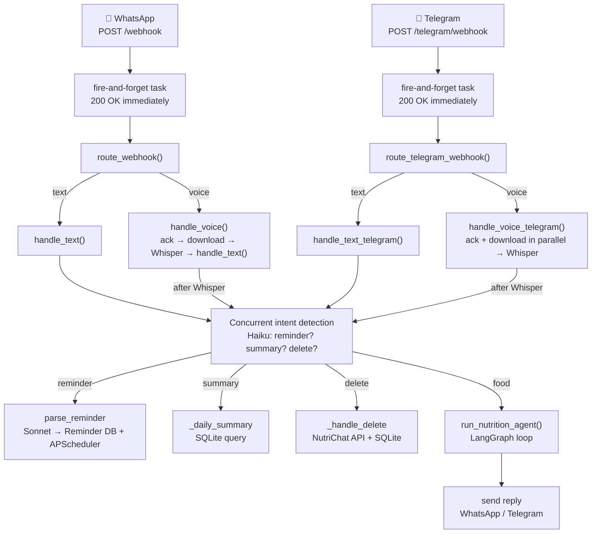
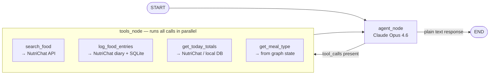

# NutriBot

A WhatsApp and Telegram bot that logs meals and tracks daily nutrition via voice or text. Powered by Claude (Anthropic) for food parsing and intent detection, NutriChat for an accurate food database and diary, and Groq/OpenAI Whisper for voice transcription.

> **Try it out:** [t.me/@Calorie_TrackingBot](https://t.me/Calorie_TrackingBot)

---

## Features

- **Log meals by text or voice** — describe what you ate naturally ("had 2 eggs and a bowl of oats") and the bot parses, searches, and logs everything
- **NutriChat diary sync** — entries written directly to your NutriChat account with accurate macros from a real food database
- **LLM fallback** — if no food database is connected, Claude estimates macros from its knowledge
- **Daily summary** — ask for today's totals at any time
- **Delete entries** — remove logged entries by meal type or for the whole day
- **Meal reminders** — set recurring reminders ("remind me to log lunch at 1pm every weekday")
- **Timezone-aware meal type** — infers breakfast/lunch/dinner/snack from the user's local time (phone country code or explicit `/timezone` setting)
- **Agentic pipeline** — LangGraph multi-phase agent handles multi-item meals in a single message with parallel food searches
- **Short-term memory** — MongoDB-backed LangGraph checkpointer preserves conversation context within each day (thread resets daily)
- **WhatsApp + Telegram** — same core pipeline, two bot surfaces

---

## System Requirements

- Python 3.12+
- [Meta Developer](https://developers.facebook.com/) app with WhatsApp Cloud API (for WhatsApp)
- [Telegram Bot Token](https://core.telegram.org/bots) from BotFather (for Telegram)
- [Anthropic API](https://console.anthropic.com/) key
- [Groq API](https://console.groq.com/) key (optional — faster transcription; falls back to OpenAI)
- [OpenAI API](https://platform.openai.com/) key (Whisper fallback)
- [MongoDB](https://www.mongodb.com/) instance (optional — enables per-day agent memory)
- [NutriChat](https://nutrichat.app/) account (optional — enables food database lookups and diary sync)

---

## Installation

```bash
git clone https://github.com/Arpan-Mishra/caloriebot.git
cd caloriebot

python3.12 -m venv venv
source venv/bin/activate
pip install -r requirements.txt
```

---

## Configuration

Copy `.env.example` to `.env` and fill in the values:

```env
# WhatsApp / Meta Cloud API
WHATSAPP_PHONE_NUMBER_ID=        # from Meta Developer Console → WhatsApp → API Setup
WHATSAPP_ACCESS_TOKEN=           # from Meta Developer Console (regenerate when expired)
WHATSAPP_VERIFY_TOKEN=           # arbitrary string — must match Meta webhook config

# Telegram
TELEGRAM_BOT_TOKEN=              # from BotFather
TELEGRAM_WEBHOOK_SECRET=         # optional — secret token for webhook verification
APP_BASE_URL=                    # public URL of this server (used to auto-register Telegram webhook)

# AI APIs
ANTHROPIC_API_KEY=               # claude-opus-4-6 (agent) + claude-haiku-4-5 (intent) + claude-sonnet-4-6 (reminders)
GROQ_API_KEY=                    # optional — Groq Whisper (whisper-large-v3-turbo, ~10x faster)
OPENAI_API_KEY=                  # whisper-1 fallback for voice transcription

# NutriChat (optional — per-user API key linked via bot command)
NUTRICHAT_BASE_URL=              # defaults to https://nutrichat-production.up.railway.app

# FatSecret (optional — legacy fallback, not used in main flow)
FATSECRET_CONSUMER_KEY=
FATSECRET_CONSUMER_SECRET=

# Database
DATABASE_URL=sqlite:///./calorie_bot.db
MONGODB_URI=                     # optional — MongoDB connection for LangGraph checkpointer

# Admin
ADMIN_SECRET=                    # protects /admin/* endpoints
```

> Config is loaded via `pydantic-settings` and cached at startup. Restart the server after changing `.env`.

---

## Running Locally

```bash
# Development (hot-reload)
venv/bin/uvicorn app.main:app --reload --port 8000

# Background (production-like)
nohup venv/bin/uvicorn app.main:app --port 8000 >> /tmp/calorie_bot.log 2>&1 &

# Verify
curl http://localhost:8000/health

# Logs
tail -f /tmp/calorie_bot.log

# Stop background server
pkill -f "uvicorn app.main:app"
```

Expose a public URL for Meta's webhook (WhatsApp) and Telegram:

```bash
ngrok http 8000
```

Set the ngrok URL as your webhook in the Meta Developer Console. For Telegram, register the webhook via the admin endpoint once the server is running.

---

## Deployment

Configured for [Railway](https://railway.app/). Push to `main` to deploy automatically. Environment variables mirror the `.env` values above. `DATABASE_URL` can remain SQLite for single-instance deployments.

---

## NutriChat Account Linking

### WhatsApp
Send:
```
link nutrichat_live_YOUR_API_KEY
```

### Telegram
Same command works in Telegram too.

The bot validates the key against NutriChat and stores it. Once linked, all meals are logged to the NutriChat diary with accurate food database lookups. Without a key, macros are estimated by the LLM and stored locally only.

Find your API key in the NutriChat app settings.

---

## Bot Commands

| Command | Platform | Description |
|---------|----------|-------------|
| `/info` | WhatsApp, Telegram | Show how to use the bot |
| `/connect` | WhatsApp | Show NutriChat linking instructions |
| `/start` | Telegram | Welcome message + setup guide |
| `/timezone Asia/Kolkata` | WhatsApp, Telegram | Set your IANA timezone for correct meal type inference |

---

## Architecture

### Module overview

```
app/
├── main.py                  # FastAPI app, lifespan, HTTP endpoints
├── config.py                # pydantic-settings (reads .env)
├── database.py              # SQLAlchemy engine + session factory
├── models.py                # ORM models (User, MealEntry, TelegramUser, Reminder, …)
├── schemas.py               # Pydantic request/response schemas
├── handlers/
│   ├── webhook.py           # Routes incoming WhatsApp events by message type
│   ├── text_handler.py      # WhatsApp: intent detection + food logging orchestration
│   ├── voice_handler.py     # WhatsApp: download → Whisper → handle_text
│   └── telegram_handler.py  # Telegram: full handler (text, voice, commands, intents)
└── services/
    ├── whatsapp.py          # Meta Cloud API: send messages, download media, parse payloads
    ├── telegram_messenger.py# Telegram Bot API: send messages, download media, parse payloads
    ├── nutrition.py         # Claude: intent detection (Haiku) + reminder parsing (Sonnet)
    ├── nutrition_agent.py   # LangGraph 6-phase food logging agent (Claude Opus 4.6)
    ├── nutrichat_svc.py     # NutriChat SDK: search, diary logging, deletion, daily totals
    ├── fatsecret.py         # FatSecret OAuth + diary (legacy — WhatsApp only)
    ├── transcription.py     # Groq Whisper (primary) + OpenAI Whisper (fallback)
    └── scheduler.py         # APScheduler: reminder cron jobs (WhatsApp + Telegram)
```

### Request flow



### LangGraph agent

The nutrition agent (`nutrition_agent.py`) runs a ReAct-style loop with **Claude Opus 4.6** and four tools. Tool calls within a single agent turn run concurrently via `asyncio.gather`.



**Six phases** the agent reasons through before making tool calls:

| Phase | Action | Tools used |
|-------|--------|------------|
| 1 — Parse | Extract item names, quantities, search queries | none |
| 2 — Search | Search food database for every item in parallel | `search_food` × N |
| 3 — Select + calculate | Pick best match by `match_score`; compute `number_of_units`; scale macros | none |
| 4 — Log | Log all items in one call | `log_food_entries` |
| 5 — Totals | Fetch today's full-day totals (includes this meal) | `get_today_totals` |
| 6 — Reply | Format WhatsApp/Telegram message with breakdown | none |

If no food database is connected, Phases 2–3 are skipped and Claude estimates macros directly.

**Agent state (`NutritionAgentState`):**

| Field | Set by | Purpose |
|-------|--------|---------|
| `messages` | LangGraph / nodes | Append-only conversation history (system prompt + all turns) |
| `meal_type` | invocation | Meal type inferred at log time |
| `has_nutrichat` | invocation | Whether NutriChat is connected |
| `food_description` | `log_food_entries` | Human-readable meal description (memory anchor) |
| `logged_items` | `log_food_entries` | Per-item macros (memory anchor) |
| `entry_ids` | `log_food_entries` | NutriChat diary entry IDs for cross-reference |

Thread ID format: `{user_id}_{YYYY-MM-DD}` — resets daily, persisted to MongoDB when `MONGODB_URI` is set.

---

## Services Reference

### `nutrition.py` — Intent detection & reminder parsing
Uses synchronous `anthropic.Anthropic` client.

| Function | Model | Returns |
|----------|-------|---------|
| `is_reminder_request(text)` | `claude-haiku-4-5-20251001` | `bool` |
| `is_summary_request(text)` | `claude-haiku-4-5-20251001` | `bool` |
| `is_delete_request(text)` | `claude-haiku-4-5-20251001` | `bool` |
| `parse_reminder(text)` | `claude-sonnet-4-6` | `ReminderConfig` with cron expression |

### `nutrichat_svc.py` — NutriChat integration
Wraps the async `NutriChatClient` SDK. Adapts responses to the internal dict format used by the agent.

| Function | Description |
|----------|-------------|
| `search_food(query, api_key)` | Search NutriChat, return up to 5 matches with `match_score` |
| `log_food_entries_batch(items, meal_type, api_key)` | Batch log to NutriChat diary |
| `get_food_entries_today(api_key)` | Today's totals from NutriChat (source of truth) |
| `delete_food_entries(api_key, meal_type, target_date)` | Delete diary entries |

### `fatsecret.py` — FatSecret integration (legacy)
OAuth 1.0a via `pyfatsecret`. Used as a fallback for WhatsApp users who linked FatSecret before NutriChat integration. Not used in the main agent flow for new users.

### `transcription.py` — Voice transcription
Tries Groq `whisper-large-v3-turbo` first (~10× faster than OpenAI), falls back to OpenAI `whisper-1` if Groq key is absent or the call fails.

### `scheduler.py` — Reminder jobs
`AsyncIOScheduler` (APScheduler). Cron expressions are 5-field standard format. Jobs survive restarts by reloading active `Reminder` rows at startup. Supports both `whatsapp` and `telegram` platforms.

---

## Data Models

| Model | Table | Key columns |
|-------|-------|-------------|
| `User` | `users` | `phone_number` (unique), `nutrichat_api_key`, `fatsecret_access_token`, `timezone` |
| `TelegramUser` | `telegram_users` | `user_id` (FK), `chat_id` (unique), `username`, `timezone` |
| `MealEntry` | `meal_entries` | `user_id`, `meal_type`, `food_description`, `calories`, `protein_g`, `fat_g`, `carbs_g`, `logged_at`, `fatsecret_entry_id` |
| `Reminder` | `reminders` | `user_id`, `label`, `cron_expression`, `message`, `active`, `platform` |
| `SystemConfig` | `system_config` | `key` (PK), `value` — runtime-configurable settings (e.g. WhatsApp token override) |
| `OAuthTemp` | `oauth_temp` | Transient FatSecret OAuth state; rows deleted after callback |
| `ConversationState` | `conversation_states` | Legacy multi-turn state; no longer used in main flow |

Phone numbers stored as bare digits, no `+` prefix (e.g. `919958325792`). `_normalize_phone()` enforces this. Telegram users identified by `chat_id`; a synthetic `phone_number` (`tg:{chat_id}`) is stored in `users` for foreign key compatibility.

---

## API Endpoints

| Method | Path | Description |
|--------|------|-------------|
| `GET` | `/webhook` | Meta webhook verification handshake |
| `POST` | `/webhook` | Receive WhatsApp messages |
| `POST` | `/telegram/webhook` | Receive Telegram updates |
| `GET` | `/health` | Health check |
| `GET` | `/admin/telegram/set-webhook` | Register Telegram webhook URL (requires `secret`) |
| `GET` | `/connect/fatsecret` | Start FatSecret OAuth flow (legacy) |
| `GET` | `/connect/fatsecret/callback` | FatSecret OAuth callback (legacy) |
| `GET` | `/admin/token-status` | Show active WhatsApp token info (requires `secret`) |
| `GET` | `/admin/clear-token-override` | Clear DB token override (requires `secret`) |
| `POST` | `/admin/update-whatsapp-token` | Update WhatsApp token at runtime (requires `secret` in body) |

---

## Future Work

- **Cross-day memory** — change thread ID from `{user_id}_{date}` to `{user_id}` so the agent remembers past meals across days; the MongoDB checkpointer is already wired up
- **Photo meal logging** — accept image messages; use Claude's vision to identify food items before running the standard agent pipeline
- **Goal tracking** — let users set daily calorie/macro targets; surface progress in summaries and reminders
- **Weekly / monthly reports** — scheduled digest of totals, streaks, and trends pulled from the local DB
- **Barcode scanning** — accept a photo of a product barcode; resolve to a NutriChat food entry automatically
- **Remove FatSecret code** — FatSecret is no longer used for new users; clean up `fatsecret.py`, OAuth endpoints, and related DB columns once legacy users are migrated
- **Horizontal scaling** — replace SQLite with Postgres and APScheduler with a distributed job queue (e.g. Celery + Redis) for multi-instance Railway deployments
- **Richer delete UX** — support "delete the eggs I just logged" via agent-assisted entry lookup rather than full meal-type deletion

---

## Citations & Acknowledgments

| Library / Service | Role |
|-------------------|------|
| [Anthropic Claude](https://www.anthropic.com/) | Intent detection (Haiku), reminder parsing (Sonnet), agentic food logging (Opus 4.6) |
| [LangGraph](https://github.com/langchain-ai/langgraph) | Agent graph runtime — ReAct loop, state management, MongoDB checkpointer |
| [LangChain Anthropic](https://python.langchain.com/docs/integrations/chat/anthropic/) | `ChatAnthropic` LLM wrapper with tool binding |
| [NutriChat](https://nutrichat.app/) | Food database search, diary logging, and daily totals API |
| [Groq](https://groq.com/) | Fast Whisper transcription (`whisper-large-v3-turbo`) |
| [OpenAI Whisper](https://platform.openai.com/docs/guides/speech-to-text) | Voice transcription fallback (`whisper-1`) |
| [FastAPI](https://fastapi.tiangolo.com/) | Async HTTP server and webhook routing |
| [SQLAlchemy](https://www.sqlalchemy.org/) | ORM + SQLite persistence |
| [pydantic-settings](https://docs.pydantic.dev/latest/concepts/pydantic_settings/) | Typed config from `.env` |
| [APScheduler](https://apscheduler.readthedocs.io/) | Cron-based meal reminder jobs |
| [phonenumbers](https://github.com/daviddrysdale/python-phonenumbers) | Timezone inference from WhatsApp phone number country code |
| [pymongo](https://pymongo.readthedocs.io/) | MongoDB client for LangGraph checkpointer |

---

## License

MIT
